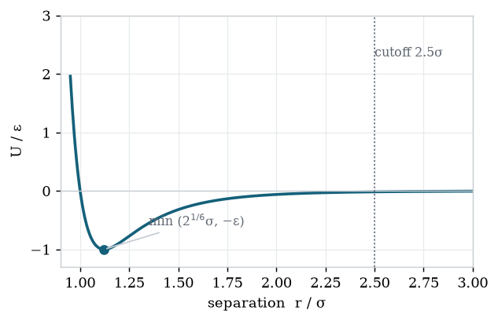
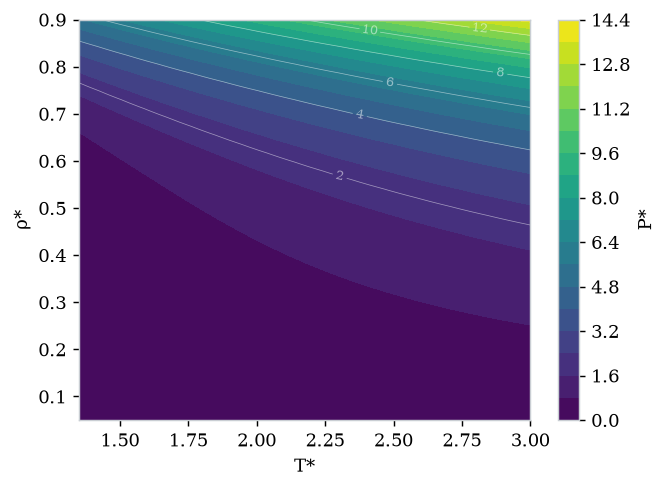
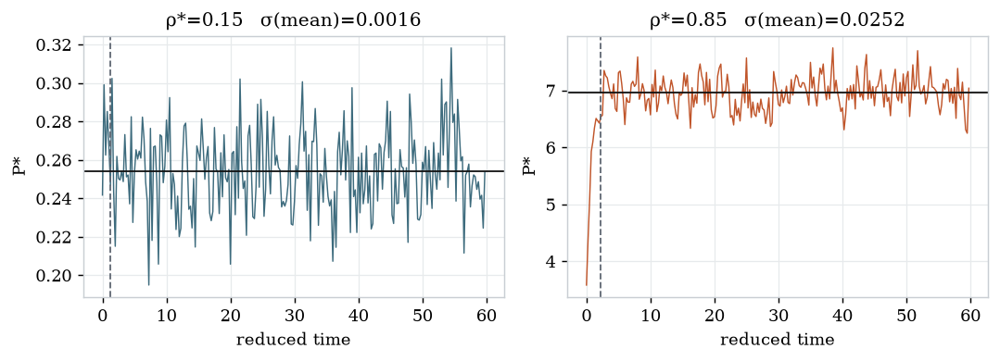
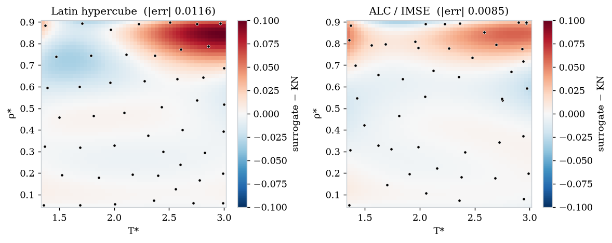
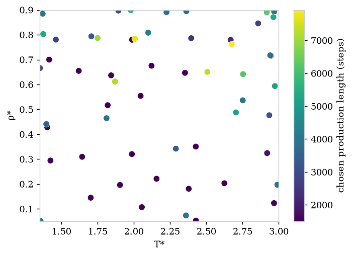

# md-active-learning

Active learning over a molecular-dynamics oracle: learn the equation of state of a
Lennard-Jones fluid with as few simulations as possible, using **calibrated uncertainty**
to decide what to simulate next — and, cost-aware, *how long* to run each simulation.

> **Interactive version (recommended):** **https://sncr0.github.io/md-active-learning/** —
> the same write-up with interactive Plotly figures. This README mirrors it with static plots.

---

## Abstract

A molecular-dynamics (MD) simulator is an expensive, noisy oracle whose noise can be paid down
by running longer. This project treats the choice of which thermodynamic states to simulate — and
for how long — as sequential experimental design, scored against an analytic equation of state so
that error is measurable everywhere. On a supercritical Lennard-Jones fluid the naive
variance-seeking rule fails exactly as predicted; a decision-theoretic rule is the most accurate
and the most reliable; and a cost-aware policy spends long, precise runs only on the few states
that need them.

## 1. Background

An MD simulator, treated as a data source, has three awkward properties.

- **It is expensive.** Each query costs seconds to hours, so the input space cannot be swept densely.
- **It is noisy, and unevenly so.** Every observable is a finite-time average of a fluctuating,
  correlated signal; the noise varies by more than an order of magnitude across the domain.
- **The noise is a control variable.** Run longer and it shrinks as $1/\sqrt{N_\mathrm{eff}}$. So
  *how precisely* to measure a point is a decision, weighed against compute.

The last two together are the whole problem: an oracle where you choose both *where* to query and
*how precisely*. That is experimental design, not curve fitting.

## 2. The system

**2.1 Interaction.** A single-site Lennard-Jones fluid — structureless particles in a periodic box,
interacting only through one pair potential:

$$U(r) = 4\varepsilon\left[\left(\tfrac{\sigma}{r}\right)^{12} - \left(\tfrac{\sigma}{r}\right)^{6}\right]$$

The $r^{-12}$ term is repulsion, $r^{-6}$ attraction; the well sits at $r=2^{1/6}\sigma$ with depth
$\varepsilon$. Truncated at $2.5\sigma$ with analytic long-range corrections to energy and pressure.



**2.2 Units and ensemble.** Reduced units set $\sigma=\varepsilon=m=1$, so the phase diagram
collapses onto two knobs: temperature T\* and density ρ\* = Nσ³/V. We hold $N=864$, $V$,
and T\* fixed — the **NVT** ensemble — with a Langevin thermostat. The cubic box has side
L = (N/ρ\*)^(1/3)·σ under periodic boundaries; particles start on an FCC lattice and melt.

**2.3 Observables.** Pressure follows from the virial — the ideal-gas term plus the average of every
pair force projected onto its separation:

$$P = \rho\,k_B T + \frac{1}{3V}\left\langle \sum_{i<j}\mathbf{r}_{ij}\cdot\mathbf{f}_{ij}\right\rangle$$

Potential energy per particle U\* comes from the same trajectory; self-diffusion D\* is a
later, harder estimator built on a mean-squared-displacement fit.

**2.4 The target.** For each observable we want the *response surface* over the (T\*, ρ\*)
plane. The reason to start with a Lennard-Jones fluid is that this surface is known analytically —
the **Kolafa–Nezbeda** equation of state, accurate to ~1% — so the surrogate's error can be
evaluated everywhere on a dense grid, not on a small held-out set.



One restriction: below the critical temperature (T\*c ≈ 1.31) an NVT box phase-separates and
pressure stops being smooth. We stay supercritical, T\* ≥ 1.35.

## 3. Noise and the estimator

A run produces a trajectory; an observable is a time average that, by ergodicity, estimates the
ensemble average. Two facts make the obvious error bar wrong. The opening transient is not drawn
from equilibrium and must be discarded at a detected cutoff; and consecutive frames are correlated,
so $M$ frames are worth far fewer than $M$ independent samples.



*Same temperature, two densities. Dashed line = detected equilibration; solid line = production
mean. The dense fluid's mean carries 15× the standard error of the dilute one — the noise is
**heteroscedastic**.*

The variance of the mean is inflated by the statistical inefficiency $g$:

$$\mathrm{Var}(\bar A)=\frac{\sigma_A^2}{N_\mathrm{eff}},\qquad N_\mathrm{eff}=\frac{M}{g},\qquad g = 1 + 2\sum_{k\ge1}\rho(k)$$

where $\rho(k)$ is the autocorrelation at lag $k$. Typically $g\approx5$–$50$; reporting
$\sigma_A/\sqrt{M}$ instead makes the error bar 2–7× too small. That number feeds the decision layer
directly, so the estimator was built and validated first, against synthetic series of known $g$.

## 4. Surrogate and acquisition

**Three layers.** The **oracle** maps a run configuration to a trajectory; the **estimator** maps a
trajectory to an observable with honest uncertainty; the **decision** layer maps all observations so
far to the next query. The surrogate never touches trajectory data.

**The surrogate** is a Gaussian process. Each datum is a noisy observation of a latent surface,
$y_i = f(\mathbf{x}_i) + \varepsilon_i$ with $\varepsilon_i\sim\mathcal{N}(0,\sigma_n^2(\mathbf{x}_i))$.
Per-point noise enters as the GP's diagonal (not a kernel term), so the predictive variance splits:

$$s_\mathrm{tot}^2(\mathbf{x}) = \underbrace{s_\mathrm{epi}^2(\mathbf{x})}_{\text{reducible}} + \underbrace{\sigma_n^2(\mathbf{x})}_{\text{irreducible}}$$

Epistemic variance shrinks with data; aleatoric variance is the measurement noise at the chosen run
length. Keeping the two apart is the whole game.

**Four ways to pick the next point:** Latin hypercube (space-filling baseline); max variance
($a=s_\mathrm{tot}^2$, expected to chase noise and fail); epistemic ($a=s_\mathrm{epi}^2$); and
ALC/IMSE (score by reduction of integrated variance *everywhere*).

## 5. Results — which acquisition learns fastest

Integrated absolute error against KN over a dense grid, mean of 3 seeds; all strategies share the
same 8-point initial design (error ≈ 0.43).


| sims | latin hypercube | max variance | epistemic | **alc / imse** |
|---:|---:|---:|---:|---:|
| 16 | **0.0201** | 0.0277 | 0.0277 | 0.1174 |
| 24 | **0.0126** | 0.0138 | 0.0139 | 0.0254 |
| 32 | 0.0123 | 0.0125 | 0.0124 | **0.0111** |
| 40 | 0.0111 | 0.0124 | 0.0108 | **0.0082** |
| 48 | 0.0093 | 0.0116 | 0.0102 | **0.0084** |

- **Max variance — the trap, confirmed.** Worst at the end and *stops improving* past ~32 runs: it
  resamples the noisiest region, where total variance is dominated by irreducible noise. Reproduced
  across all three seeds.
- **Latin hypercube — a real baseline.** Best at small budgets; on a smooth 2-D surface, space-filling
  is hard to beat.
- **ALC/IMSE — wins late, wins on consistency.** Starts worst, crosses over around 31 runs, finishes
  lowest and with the tightest band — ~4× more repeatable than LHS.
- **Epistemic — quietly solid.** Tracks LHS, ends just behind ALC.

**Where the error lives.** Almost all of it is the high-density, high-temperature corner, where
pressure is steepest. A uniform design under-resolves it; ALC concentrates there.



*A floor everyone hits:* the finite (864-particle, cutoff) simulations differ from the full-potential
EOS by a small fixed amount (~0.008). Every strategy piles up against it, so the contest is how
*fast* you reach the floor — which is why the active-learning margin here is real but modest.

## 6. Results — spending a budget, not counting runs

Stage 2 lets the policy choose each run's length $\ell$ under a fixed compute budget. Longer runs
cost more ($c_0+c_1\ell$) but return lower noise ($\sigma_n^2=K(\mathbf{x})/\ell$). Maximizing
variance-reduction-per-cost has a closed-form optimal length:

$$\ell^\star(\mathbf{x})=\sqrt{\frac{K(\mathbf{x})\,c_0}{s_\mathrm{epi}^2(\mathbf{x})\,c_1}}$$

Run longer where the noise $K$ is large; shorter where the function is already uncertain.



Against a fixed-length baseline at equal budget, the cost-aware policy ran **56 shorter simulations**
(mean ~3,300 steps, adaptively 1,500–7,900) versus **48 at 5,000**, for slightly lower error at
slightly lower cost. Spatially it banked ~2× more production in the high-density corner than in the
quiet majority. Many cheap samples or few precise ones? *Both, placed deliberately.*

## 7. Discussion

The headline that did *not* appear is itself the result: on a smooth 2-D surface, against a strong
space-filling baseline and a finite-size floor, active learning's margin is modest. What holds
cleanly is sharper — the naive rule fails in a specific, predicted way, and the principled rule is
both the most accurate and the most reliable. The regimes where adaptivity should dominate are the
ones this benchmark lacks: higher input dimension, a localized target (e.g. tracing the
coexistence-dome boundary), and larger budgets. Cost-aware allocation is the first step there.

---

## Architecture

Three layers with narrow interfaces; the surrogate never reaches into trajectory data.

```
RunConfig ─▶ ORACLE ─▶ trajectory ─▶ ESTIMATOR ─▶ Observation(value, σ, n_eff) ─▶ STORE
                                                                                     │
                                                                    (X, y, noise_var)│
                                                                                     ▼
                                                                 SURROGATE ◀── DECISION
                                                            (heteroscedastic GP)  (where, how long)
```

```
src/mdal/
  config.py      RunConfig + content hash (the store key)      cost.py     linear cost model (Stage 2)
  domain.py      the (T*, ρ*) input domain                     records.py  boundary contracts
  oracle/        settings -> trajectory (OpenMM LJ, swappable)
  estimator/     trajectory -> observable with honest uncertainty (pymbar)
  surrogate/     heteroscedastic GP (scikit-learn)
  decision/      acquisition functions (Stage 1 + cost-aware)
  reference/     Kolafa-Nezbeda analytic EOS (ground truth)
  store/         content-hash-keyed DuckDB store (resumable)
  executor/      single-writer process pool
  campaign/      the active-learning loops
  analysis/      error map + acquisition comparison
tests/           unit + integration tests        scripts/   benchmark, campaign, and figure drivers
```

## Running

```bash
uv sync --extra md --extra surrogate --extra viz   # openmm, scikit-learn, matplotlib
uv run pytest                                       # full suite (some tests need the md extra)

uv run python scripts/benchmark_oracle.py           # per-sim cost + thread vs pool throughput
uv run python scripts/compare_acquisitions.py       # Stage 1 acquisition comparison
uv run python scripts/cost_aware_demo.py            # Stage 2 cost-aware vs fixed-length
uv run python scripts/build_figdata.py              # regenerate figure data for the docs/page
uv run python scripts/build_readme_figures.py       # regenerate the static figures in this README
```

The estimator imports `pymbar`; the oracle imports `openmm` lazily, so the core package installs and
imports without the `md` extra. All runs are on one laptop, seconds per simulation.
