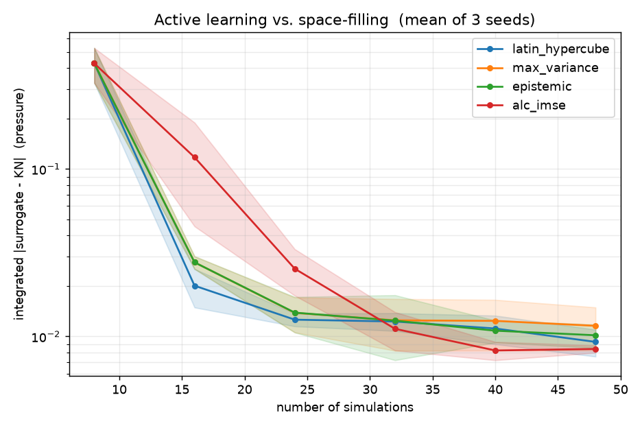
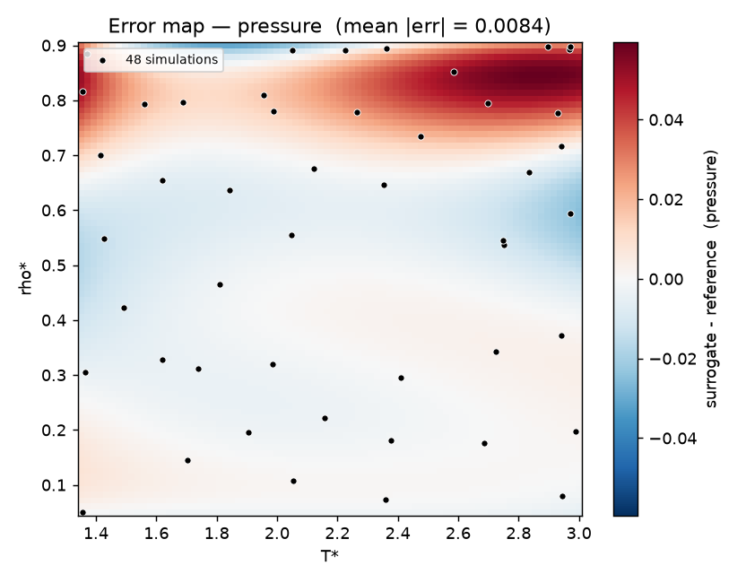
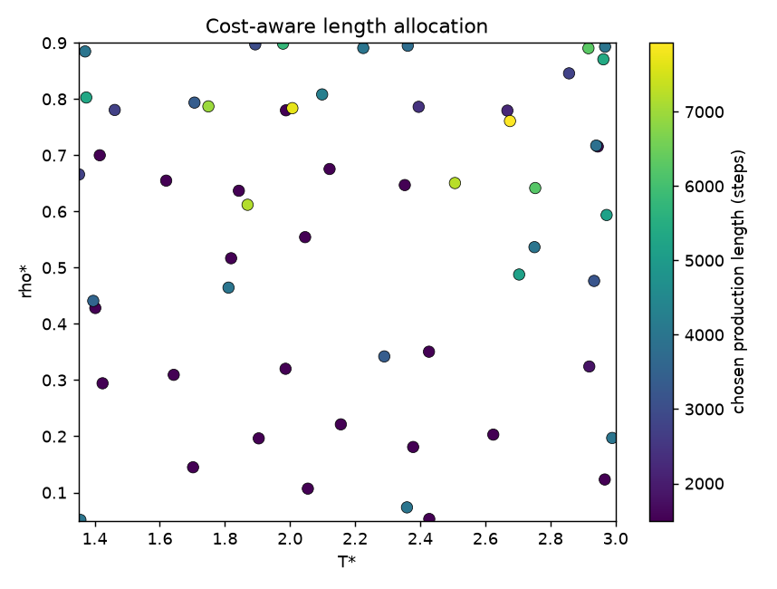

# md-active-learning

Active learning over a molecular-dynamics oracle: learn the equation of state of
a Lennard-Jones fluid with as few simulations as possible, using **calibrated
uncertainty** to decide what to simulate next — and, in the cost-aware stage,
*how long* to run each simulation.

## The idea

A molecular-dynamics simulator is an *oracle* with three awkward properties that
most regression setups never confront:

1. **It is expensive** — seconds to hours per query; the input space can't be brute-forced.
2. **It is noisy, non-uniformly** — every observable is a finite-sample estimate from a
   correlated time series, and the noise varies by orders of magnitude across the domain.
3. **The noise is a control variable** — run longer and it shrinks as ≈ 1/√(effective samples).
   So *how precisely to know a point* is a decision, not a fixed property.

This project treats "**which state point do I simulate, and for how long?**" as a
sequential experimental-design problem.

## Architecture

Three layers with narrow interfaces; the surrogate never touches trajectory data.

```
RunConfig ─▶ ORACLE ─▶ trajectory ─▶ ESTIMATOR ─▶ Observation(value, σ, n_eff) ─▶ STORE
 (T*, ρ*,   (OpenMM     (frames)     (equilibration,                                │
  N, seed,   LJ fluid,                autocorrelation →           (X, y, noise_var)  │
  length)    reduced                 honest σ)                                       ▼
             units)                                             SURROGATE ◀── DECISION
                                                              (heteroscedastic  (acquisition:
                                                               GP)               where, how long)
```

- **Oracle** — `oracle/lennard_jones.py`: single-site LJ fluid in a periodic box, NVT Langevin,
  reduced units. Pressure via a box-scaling finite-difference of the virial (captures the
  analytic tail correction automatically).
- **Estimator** — `estimator/`: turns a trajectory into an observable with an
  *autocorrelation-corrected* standard error (`pymbar`: equilibration detection + statistical
  inefficiency). Built and validated first, against synthetic AR(1) series of known
  inefficiency.
- **Surrogate** — `surrogate/gp.py`: heteroscedastic Gaussian process. Per-point observation
  noise enters as the GP `alpha` vector (not a `WhiteKernel`), which cleanly separates
  **epistemic** (reducible) from **aleatoric** (irreducible) uncertainty.
- **Decision** — `decision/`: Latin-hypercube baseline, naive max-variance, epistemic-only,
  and integrated-variance-reduction (ALC/IMSE); plus cost-aware acquisition (Stage 2).
- **Reference** — `reference/kn_eos.py`: the Kolafa–Nezbeda (1994) analytic equation of state,
  so surrogate error can be measured *everywhere* on a dense grid, not just on held-out points.
- **Store / Executor / Campaign** — content-hash-keyed DuckDB store (resumable), a
  single-writer process pool, and the active-learning loop that ties it together.

## Stage 1 — supercritical Lennard-Jones pressure surface (complete)

Domain: T\* ∈ [1.35, 3.0], ρ\* ∈ [0.05, 0.9] (supercritical, excludes the coexistence dome).

- **Oracle validated against the analytic EOS** — independent MD and Kolafa–Nezbeda agree at
  T\*=2, ρ\*=0.3 to within ~0.2σ (pressure) and ~0.6% (energy).
- **Acquisition comparison** (integrated |surrogate − reference|, mean of 3 seeds, 48 sims):
  naive max-variance is the worst and stops improving — the classic *acquisition trap* of
  resampling irreducible noise; ALC/IMSE finishes most accurate and by far the most consistent;
  a Latin-hypercube design is a genuinely strong baseline on this smooth 2-D surface.



The dominant error lives in the high-density / high-temperature corner (steepest pressure), where
adaptive sampling helps most:



## Stage 2 — cost-aware active learning (in progress)

Simulation length becomes a decision variable. With noise σ²(x, ℓ) = K(x)/ℓ and cost c₀ + c₁ℓ,
maximizing variance-reduction-per-cost has a closed-form optimal length

```
ℓ*(x) = sqrt( K(x) · c₀ / ( epistemic_var(x) · c₁ ) )
```

— longer runs where the noise K is large, shorter where the function is already uncertain. Under
an equal budget, the cost-aware policy took *more, shorter* samples (56 runs, mean length ~3300,
adaptively 1500–7900) than the fixed-length baseline (48 runs at 5000) and reached slightly lower
error for slightly less cost.



A visual explainer of the whole system is in [`docs/overview.html`](docs/overview.html).

## Running

```bash
uv sync --extra md --extra surrogate --extra viz   # openmm, scikit-learn, matplotlib
uv run pytest                                       # full suite (some tests need the md extra)

uv run python scripts/benchmark_oracle.py           # per-sim cost + thread vs pool throughput
uv run python scripts/compare_acquisitions.py       # Stage 1 acquisition comparison
uv run python scripts/cost_aware_demo.py            # Stage 2 cost-aware vs fixed-length
```

The estimator layer imports `pymbar`; the oracle imports `openmm` lazily, so the core package
installs and imports without the `md` extra.

## Layout

```
src/mdal/
  config.py            RunConfig + content hash (the store key)
  domain.py            the (T*, ρ*) input domain
  records.py           boundary contracts (Observation, RunRecord)
  cost.py              linear cost model (Stage 2)
  oracle/              settings -> trajectory (swappable)
  estimator/           trajectory -> observable with honest uncertainty
  surrogate/           heteroscedastic GP
  decision/            acquisition functions (Stage 1 + cost-aware)
  reference/           Kolafa-Nezbeda analytic EOS (ground truth)
  store/               content-hash-keyed DuckDB store
  executor/            single-writer process pool
  campaign/            the active-learning loops
  analysis/            error map + acquisition comparison
tests/                 unit + integration tests
scripts/               benchmark and campaign drivers
configs/               declarative campaign specs
```
